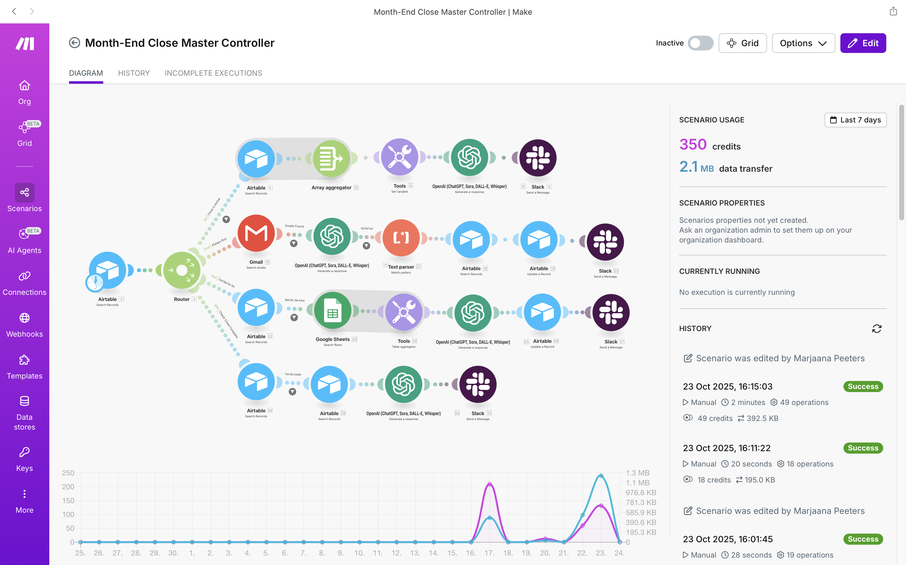
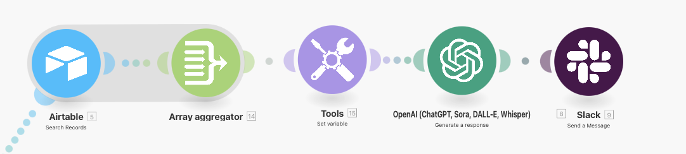
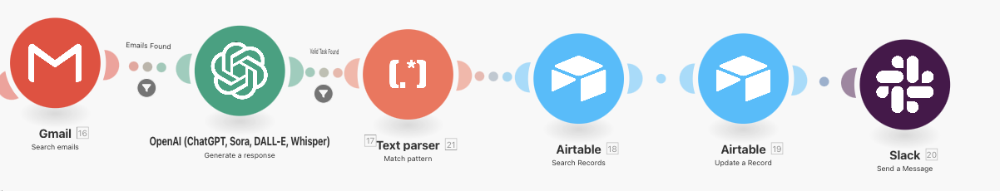
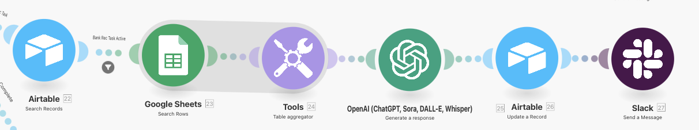
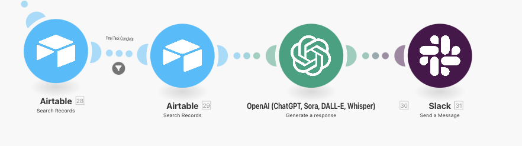
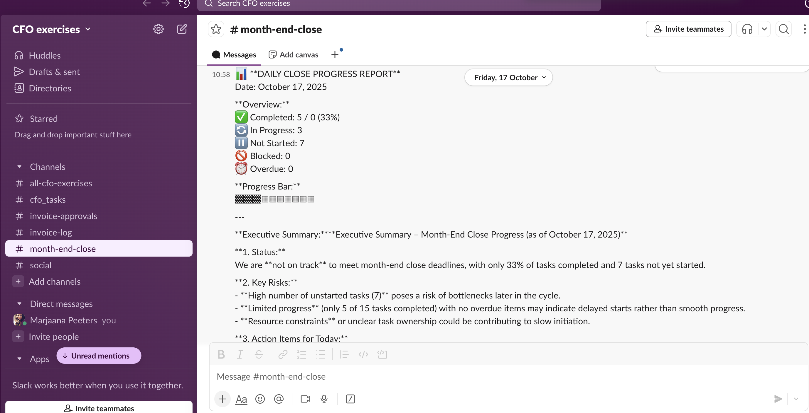
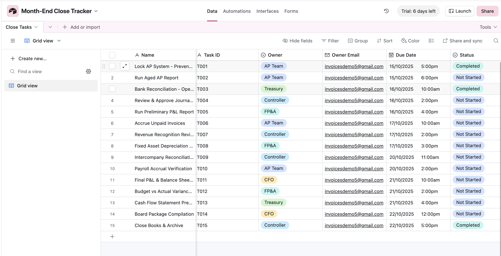

# AI-Powered Month-End Close Orchestrator

An intelligent automation system that orchestrates complex month-end close processes using OpenAI GPT-4o, eliminating manual coordination and saving 3+ hours per close cycle. Features AI email parsing, automated bank reconciliation, and executive report generation across Airtable, Gmail, Google Sheets, and Slack.



[](https://opensource.org/licenses/MIT)
[](https://make.com)
[](https://openai.com)

---

## 🎯 Business Problem

Month-end close is a tedious, error-prone process requiring constant manual coordination:
- ❌ Finance teams spend hours chasing task status updates
- ❌ Email updates require manual data entry into tracking systems
- ❌ Bank reconciliations take 2+ hours of manual work
- ❌ Progress visibility requires constant check-ins
- ❌ Final reporting involves manual data compilation

**Result:** 7-10 day close cycles with significant manual overhead.

---

## ✨ Solution

An AI-powered automation that:
- ✅ Generates intelligent daily progress summaries using GPT-4o
- ✅ Reads email updates and automatically extracts task status
- ✅ Performs automated bank reconciliations with variance analysis
- ✅ Creates comprehensive executive close reports
- ✅ Provides real-time Slack notifications across all stages

**Result:** 5-day close cycles with 70% less manual coordination.

---

## 🏗️ Architecture

### System Components

| Component | Purpose | Cost |
|-----------|---------|------|
| **Make.com** | Orchestration engine | Free (1,000 ops/month) |
| **Airtable** | Task database & tracking | Free tier |
| **OpenAI GPT-4o** | AI parsing & analysis | ~$0.50/close |
| **Google Sheets** | Bank transaction data | Free |
| **Gmail** | Email monitoring | Free |
| **Slack** | Notifications | Free tier |

**Total Monthly Cost:** ~$0.50 (OpenAI only)

### Workflow Overview
```
┌─────────────────────────────────────────────────────────────┐
│                    Make.com Orchestrator                     │
│                   (Runs Daily at 9:00 AM)                    │
└─────────────────────────────────────────────────────────────┘
                              │
                ┌─────────────┴─────────────┐
                │         Router            │
                └─────────────┬─────────────┘
                              │
        ┌─────────────────────┼─────────────────────┬──────────────────┐
        │                     │                     │                  │
   ┌────▼────┐           ┌────▼────┐           ┌───▼────┐       ┌─────▼─────┐
   │ Route 1 │           │ Route 2 │           │ Route 3│       │  Route 4  │
   │ Daily   │           │ Email   │           │  Bank  │       │   Final   │
   │ Report  │           │ Parser  │           │  Rec   │       │  Report   │
   └────┬────┘           └────┬────┘           └───┬────┘       └─────┬─────┘
        │                     │                    │                   │
        │                     │                    │                   │
   Airtable ──> AI ──> Slack │                    │                   │
        │                     │                    │                   │
        │         Gmail ──> AI ──> Airtable ──> Slack                 │
        │                     │                    │                   │
        │                     │         Sheets ──> AI ──> Airtable ──> Slack
        │                     │                    │                   │
        │                     │                    │         AI ──> Slack
        └─────────────────────┴────────────────────┴───────────────────┘
```

---

## 🚀 Key Features

### 1. **Daily AI Progress Reports** (Route 1)
- **Trigger:** Daily at 9:00 AM
- **Process:** 
  - Retrieves all 15 close tasks from Airtable
  - Calculates completion metrics
  - GPT-4o generates executive summary
  - Posts to Slack channel
- **Business Value:** Eliminates daily status meetings



**Example Output:**
```
📊 DAILY CLOSE PROGRESS REPORT
Date: October 23, 2025

Overview:
✅ Completed: 2/15 (13%)
🔄 In Progress: 3
⏸️ Not Started: 10

Executive Summary:
[AI-generated progress analysis and action items]
```

---

### 2. **Email Response Parser** (Route 2)
- **Trigger:** Continuous (checks every 15 minutes)
- **Process:**
  - Monitors Gmail for task update emails
  - GPT-4o extracts task ID and status
  - Updates Airtable automatically
  - Notifies team via Slack
- **Business Value:** Eliminates manual data entry



**Example Input Email:**
```
Subject: Task T001 completed
Body: Hi, I finished task T001 - the AP system is locked.
```

**AI Extraction:**
```
Task ID: T001
Status: Completed
Note: AP system locked
```

**Result:** Airtable updated, Slack notified, zero manual work.

---

### 3. **Automated Bank Reconciliation** (Route 3)
- **Trigger:** When Task T003 status = "In Progress"
- **Process:**
  - Reads bank transactions from Google Sheets
  - GPT-4o calculates deposits, withdrawals, balances
  - Compares actual vs. expected balances
  - Identifies variances and flags issues
  - Updates task with reconciliation summary
- **Business Value:** 2-hour manual task → 5-minute automation



**Example Output:**
```
🤖 AUTOMATED: Bank Reconciliation Complete

Beginning Balance: $125,000.00
Total Deposits: $35,325.00
Total Withdrawals: $39,485.75
Calculated Ending Balance: $120,839.25
Expected Ending Balance: $108,839.75
Variance: $12,000.00

Status: VARIANCE EXCEEDS THRESHOLD

Analysis: The $12,000 variance matches a cleared deposit from 
DEF Ltd that may have been excluded from the expected balance.
```

---

### 4. **Close Completion Report** (Route 4)
- **Trigger:** When final task (T015) marked complete
- **Process:**
  - Retrieves all completed tasks
  - GPT-4o generates comprehensive executive report
  - Includes metrics, process highlights, recommendations
  - Sends celebratory message to team
- **Business Value:** Professional reporting with zero manual effort



**Example Output:** [See examples/slack-final-report.md](examples/slack-final-report.md)

---

## 📊 Results & Impact

### Quantitative Results

| Metric | Before | After | Improvement |
|--------|--------|-------|-------------|
| Close Duration | 7-10 days | 5 days | 29-50% faster |
| Coordination Time | 4-5 hours/close | <1 hour/close | 75-80% reduction |
| Manual Data Entry | 2+ hours | 5 minutes | 96% reduction |
| Bank Rec Time | 2 hours | 5 minutes | 96% reduction |
| Status Update Lag | 24-48 hours | Real-time | Instant visibility |

### Qualitative Benefits

- ✅ **Reduced Errors:** AI extraction eliminates transcription mistakes
- ✅ **Better Visibility:** Real-time Slack updates keep everyone informed
- ✅ **Scalability:** Can handle 50+ tasks with no additional effort
- ✅ **Audit Trail:** All updates tracked in Airtable with timestamps
- ✅ **Team Morale:** Eliminates tedious manual work

---

## 🛠️ Technology Stack

### Why These Tools?

**Make.com (vs. Zapier):**
- ✅ Free tier includes multi-step workflows (Zapier charges $20/month)
- ✅ 1,000 operations/month free vs. Zapier's 100
- ✅ Superior visual workflow builder
- ✅ Better error handling and debugging

**Airtable (vs. Google Sheets):**
- ✅ Relational database with linked records
- ✅ Built-in task dependency tracking
- ✅ API access for automation
- ✅ Professional UI for stakeholders

**OpenAI GPT-4o (vs. other AI):**
- ✅ Superior reasoning for financial analysis
- ✅ Excellent at structured data extraction
- ✅ Generates professional executive summaries
- ✅ Cost-effective at ~$0.50 per close

---

## 📈 AI Capabilities Demonstrated

### Natural Language Processing
- **Email Parsing:** Extracts structured data from unstructured text
- **Intent Recognition:** Determines task status from casual language
- **Entity Extraction:** Identifies task IDs in various formats

### Financial Analysis
- **Bank Reconciliation:** Performs multi-step calculations accurately
- **Variance Analysis:** Identifies and explains discrepancies
- **Trend Analysis:** Spots patterns in transaction data

### Report Generation
- **Executive Summaries:** Creates board-ready financial summaries
- **Actionable Insights:** Provides specific recommendations
- **Professional Formatting:** Maintains consistent tone and structure

---

## 🎓 Learning Outcomes

Building this project demonstrates proficiency in:

**AI & Automation:**
- ✅ Integrating GPT-4o for intelligent document processing
- ✅ Prompt engineering for structured output
- ✅ Multi-step workflow orchestration
- ✅ Error handling in AI systems

**Financial Process Knowledge:**
- ✅ Month-end close procedures
- ✅ Bank reconciliation methodology
- ✅ Task dependency management
- ✅ Financial reporting standards

**System Integration:**
- ✅ RESTful API integration across 5 platforms
- ✅ Webhook configuration
- ✅ Data transformation between systems
- ✅ Real-time notification systems

**Data Architecture:**
- ✅ Relational database design
- ✅ Cross-system data synchronization
- ✅ State management in distributed systems

---

## 🚦 Getting Started

### Prerequisites

- Make.com account (free tier)
- Airtable account (free tier)
- OpenAI API key ($5 credit sufficient for testing)
- Google account (Gmail + Sheets)
- Slack workspace

### Quick Setup (30 minutes)

**See detailed instructions:** [docs/SETUP.md](docs/SETUP.md)

1. **Clone this repository**
```bash
   git clone https://github.com/yourusername/month-end-close-ai-orchestrator
   cd month-end-close-ai-orchestrator
```

2. **Set up Airtable**
   - Import schema from `data-samples/airtable-schema.md`
   - Load sample tasks from `data-samples/airtable-tasks.csv`

3. **Set up Google Sheets**
   - Create sheet with bank transaction template
   - Load sample data from `data-samples/bank-transactions.csv`

4. **Configure Make.com**
   - Import scenario blueprint (coming soon)
   - Connect Airtable, Gmail, Sheets, Slack, OpenAI
   - Update configuration variables

5. **Test the automation**
   - Follow testing guide: [docs/TESTING.md](docs/TESTING.md)

**Total setup time:** 30-45 minutes

---

## 📸 Screenshots

### Make.com Scenario Overview


### Slack Notifications


### Airtable Dashboard


---

## ⚠️ Known Limitations

### Current Implementation

1. **Multiple Notifications:** 
   - Each task currently generates a separate Slack message
   - **Impact:** Minor - more notifications than needed
   - **Workaround:** Filter Slack channel notifications
   - **Future Fix:** Add aggregation before final notification module

2. **Task ID Extraction:**
   - Currently uses simplified AI extraction
   - **Impact:** Low - works for standard formats (T001-T999)
   - **Future Enhancement:** Add regex validation layer

3. **Static Reconciliation Values:**
   - Expected balances currently hardcoded in prompt
   - **Impact:** Low - easily updated per close
   - **Future Fix:** Pull from Airtable configuration table

4. **Email Query Scope:**
   - Broad search may catch unrelated emails
   - **Impact:** Minor - AI filters out irrelevant emails
   - **Future Fix:** Refine Gmail search query syntax

### Production Considerations

For production deployment:
- Add error notification system
- Implement retry logic for failed API calls
- Create backup/rollback procedures
- Add comprehensive logging
- Establish monitoring dashboards

---

## 🔮 Future Enhancements

### Phase 2 (Planned)

- [ ] **Dynamic Task Dependencies**
  - Auto-trigger dependent tasks when prerequisites complete
  - Send notifications to next task owners

- [ ] **Multi-Entity Support**
  - Handle consolidation across multiple legal entities
  - Intercompany elimination automation

- [ ] **Anomaly Detection**
  - AI flags unusual transactions for review
  - Predictive analysis of close completion dates

- [ ] **Mobile Interface**
  - Status updates via SMS
  - Task completion from mobile app

### Phase 3 (Vision)

- [ ] **Voice Integration**
  - Verbal status updates via Slack/Teams calls
  - Natural language task queries

- [ ] **Predictive Close Duration**
  - ML model predicts completion date based on progress
  - Resource reallocation suggestions

- [ ] **Integration Expansion**
  - NetSuite / Sage Intacct / QuickBooks
  - Expense management systems (Expensify, Concur)
  - Revenue recognition platforms

---

## 🤝 Use Cases

This automation is ideal for:

### Target Organizations

- **Small to Mid-Market Companies** (50-500 employees)
  - Growing beyond spreadsheets
  - Need process standardization
  - Limited finance team size

- **Fractional CFO Practices**
  - Managing multiple clients
  - Demonstrating process excellence
  - Delivering scalable solutions

- **Finance Consulting Firms**
  - Showcasing automation expertise
  - Building client value propositions
  - Differentiating service offerings

### Industry Applications

- **SaaS Companies:** Monthly close with subscription revenue recognition
- **Professional Services:** Project-based revenue tracking
- **Manufacturing:** Inventory reconciliation integration
- **Non-Profit:** Grant accounting and fund tracking

---

## 💼 Professional Context

### Why This Matters for Fractional CFOs

**The Market Problem:**
Most fractional CFOs rely on manual processes and spreadsheets, limiting scalability and creating client service bottlenecks.

**This Solution Demonstrates:**
- ✅ Technical sophistication beyond traditional finance roles
- ✅ Ability to leverage cutting-edge AI for business value
- ✅ Process automation expertise
- ✅ Cost-effective solution building (<$1/month operational cost)
- ✅ Cross-functional system integration

---

## 📚 Additional Resources

### Documentation

- [Detailed Setup Guide](docs/SETUP.md)
- [Technical Architecture](docs/ARCHITECTURE.md)
- [Testing Guide](docs/TESTING.md)
- [Troubleshooting](docs/TROUBLESHOOTING.md)

### Example Outputs

- [Daily Progress Report](examples/slack-daily-report.md)
- [Email Update Notification](examples/slack-email-update.md)
- [Bank Reconciliation Summary](examples/slack-bank-rec.md)
- [Final Close Report](examples/slack-final-report.md)

### Learning Resources

- [Make.com Documentation](https://www.make.com/en/help)
- [OpenAI API Guide](https://platform.openai.com/docs)
- [Airtable API Reference](https://airtable.com/developers/web/api/introduction)

---

## 🙏 Acknowledgments

Built as a learning project to demonstrate:
- AI integration in finance processes
- Modern automation capabilities
- Cross-platform orchestration
- Cost-effective solution design

**Tools Used:**
- Make.com for workflow orchestration
- OpenAI GPT-4o for intelligent processing
- Airtable for data management
- Google Workspace for data sources
- Slack for notifications

---

## 📄 License

MIT License - feel free to use this for your own projects! 

See [LICENSE](LICENSE) for details.

---

## 👤 Author

**Marjaana Peeters**  
AI-Savvy Finance Professional

Specializing in finance automation and AI integration for growing businesses.

**Connect:**
- LinkedIn: www.linkedin.com/in/marjaana-peeters-0442a4


---

## ⭐ Star This Repo!

If this project helped you or gave you ideas, please star the repository!

**Questions?** Open an issue or reach out directly.

---

**Built with ❤️ using Make.com's free tier and $0.50 worth of AI**
